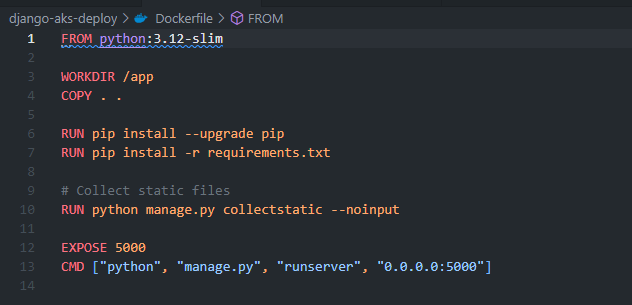

#  Django App Deployed to Azure Kubernetes Service (AKS)

This project demonstrates containerizing a Django app with Docker, pushing it to Azure Container Registry (ACR), and deploying it to Azure Kubernetes Service (AKS).

---

## Tech Stack

- Django 5.x
- Docker
- Azure CLI
- Azure Container Registry (ACR)
- Azure Kubernetes Service (AKS)

---

## Create a Dockerfile

---

## Build Dockerfile

---

## Run Locally

---

## Create a Resource Group

---

## Create ACR (Azure Container Registry)

---

## Log in to ACR

---

## Tag Docker Image

---

## Push Image to ACR

---

## Create AKS Cluster

---

## Get AKS Credentials Locally 

---

## Test connection

---

## Create Django Deployment file

---

## Apply YAML to Deploy and check status

---

## Image error but fixed this by changing the version from latest to v1

---

## Django app is live from the external public IP

---

## Acknowledgements

This project was originally forked from [heroku](https://github.com/heroku/python-getting-started).  
Credit to the original authors for the base application.

